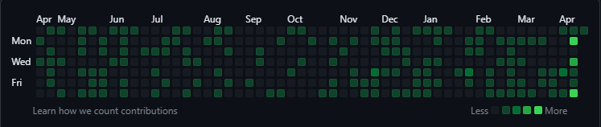

<h1 align="center">GitHeat</h1>
<p align="center">A tool to visualize your Git contributions on a heatmap</p>

<p align="center">
  
  
  
  
</p>

## Table of Contents
- [Introduction](#introduction)
- [Features](#features)
- [Getting Started](#getting-started)
  - [Prerequisites](#prerequisites)
  - [Installation](#installation)
- [Usage](#usage)
  - [Step 1: Enter Details](#step-1-enter-details)
  - [Step 2: Heatmap](#step-2-heatmap)
- [Contributing](#contributing)
- [License](#license)

## Introduction
GitHeat is a tool to visualize your Git contributions on a heatmap. It generates a heatmap to show which days you have made contributions to your Git repository, making it easy to see your development activity.

## Features
- Easy to use CLI interface
- Generates a heatmap to visualize Git contributions
- Customizable settings including number of days and commit message
- Supports push to remote Git repository

## Getting Started
### Prerequisites
- Git installed on your machine
- Bash shell (Terminal on macOS or Linux, Git Bash on Windows)

### Installation
1. Clone the repository:
```
git clone https://github.com/Hershit-shukla/GitHeat.git
```
2. Navigate to the project directory:
```
cd GitHeat
```

## Usage
### Step 1: Enter Details
1. Run GitHeat from the command line:

Windows
```
bash githeat.sh
```
macOS
```
bash githeatmacOS.sh
```
Linux
``` 
bash githeatLinux.sh
```
2. Enter your GitHub username and repository name when prompted.
3. Enter the number of days to go back for generating the heatmap.
4. Enter the name of the subdirectory to create the repository in.
5. Wait till "Done" message.

### Step 2: Heatmap
Once GitHeat has completed, a heatmap will be generated and opened in your default browser.



## Contributing
Contributions are welcome and appreciated! Please read the [contribution guidelines](./CONTRIBUTING.md) for more information.

## License
This project is licensed under the MIT License - see the [LICENSE.md](./LICENSE.md) file for details.
